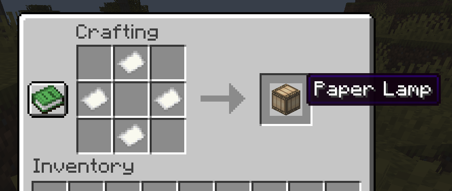
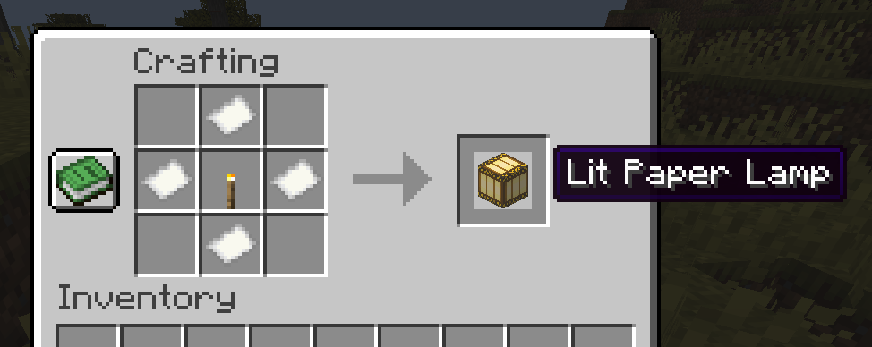
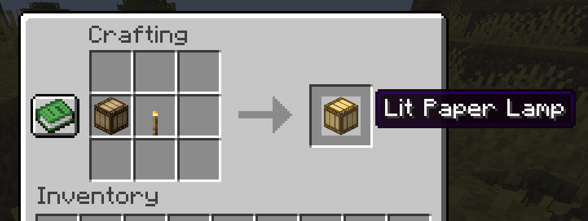

  <h1>
    Chinese paper lamps (Spout)
  </h1>

## Introduction

Adds fully server-side Chinese paper lamps, lit and unlit.

<table>
  <tr>
    <td>
      
    </td>
    <td>
      
    </td>
    <td>
      
    </td>
  </tr>
</table>

## Installation

Download the latest JAR from
[GitHub Actions](https://github.com/ModernSpout/ChinesePaperLamps-plugin/actions/workflows/build.yml),
under **Artifacts**.

Place the file into the `plugins` folder.

Requires [Spout](https://github.com/ModernSpout/Spout-Paper-server).
